# Remote GPIO Power Control

This project provides a minimal Python-based system for remotely toggling a physical power button using GPIO through a one-channel relay. It runs inside a Debian-based Docker container that exposes a small web server for local network access. The example setup uses a Raspberry Pi 3B, but any board with accessible GPIO should work. For Raspberry Pi pin references, see [https://pinout.xyz/](https://pinout.xyz/).

## Required Hardware

A PC or home server can typically be started by momentarily shorting its two power-switch pins. A low-voltage one-channel relay can simulate this action.

### Wiring Diagram

```mermaid
graph LR;

subgraph RELAY["Relay Module"]
    direction LR
    RELAY_NO["NO (Normally Open)"]
    RELAY_COM["COM (Common)"]
    RELAY_COIL_P["PIN +"]
    RELAY_COIL_N["PIN –"]
    RELAY_COIL_S["PIN S"]
end

subgraph DEVICE["Target Machine"]
    direction LR
    DEVICE_POWER_PIN1["PWR_SW +"]
    DEVICE_POWER_PIN2["PWR_SW -"]
end

subgraph CONTROLLER["Control Board (RPi)"]
    RPi_GPIO["GPIO Signal"]
    RPi_5V["3.3V/5V Power"]
    RPi_GND["Ground"]
end
DEVICE_POWER_PIN1 .- RELAY_NO
DEVICE_POWER_PIN2 .- RELAY_COM

RPi_GPIO -. Signal .- RELAY_COIL_S
RPi_5V -. Power .- RELAY_COIL_P
RPi_GND -. Ground .- RELAY_COIL_N

```



## Software Setup

Docker is required. The project uses a Debian container that includes all dependencies for GPIO control.

### 1. Configure authentication

Copy the provided `example.env` to `.env` and set your own token:


```.env
SECRET_TOKEN=MY_TOKEN_ABCDE
```

### 2. Configure GPIO script

If your system uses a different GPIO chip, ensure that the Docker Compose file maps the correct device. Adjust the devices section accordingly:

```docker-compose.yml
devices:
  - /dev/gpiochip0:/dev/gpiochip0
```

Then, adapt `./scripts/gpio/start.py`:

* Adjust `LINE` to the correct GPIO signal line you would like to switch.
* Update `/dev/gpiochip0` if your system uses a different GPIO chip.

Example file:

```./scripts/gpio/start.py
import gpiod
import time
from gpiod.line import Direction, Value
LINE = 17

with gpiod.request_lines(
    "/dev/gpiochip0",
    consumer="blink-example",
    config={
        LINE: gpiod.LineSettings(
            direction=Direction.OUTPUT, output_value=Value.ACTIVE
        )
    },
) as request:
    request.set_value(LINE, Value.ACTIVE)
    time.sleep(0.5)
    request.set_value(LINE, Value.INACTIVE)
```

### 3. (Optional) Add a new GPIO command

Copy `start.py` to a new location in scripts  (e.g. `my_command.py`) and modify timing or signal behavior there. Then add a corresponding route in `server.py`:

```server.py
@app.route("/gpio_my_command/<token>", methods=["POST"])
def gpio_my_command(token):
    if token != SECRET:
        abort(401)
    subprocess.Popen([sys.executable, "/app/scripts/gpio/my_command.py"])
    return "OK\n"
```

### 4. Build the Docker image

```sh
docker compose build
```

### 5. Start the service

```sh
docker compose up -d
```

To deactivate:

```sh
docker compose down
```

### 6. Test using a curl request (replace the IP address with that of the host machine running the container)

```sh
curl -X POST http://192.168.x.x:5454/gpio_start/<token>
```
